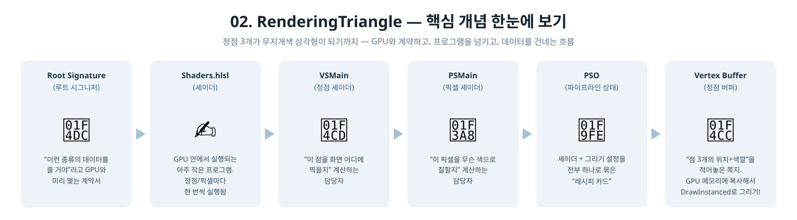

[◀ 이전 가이드: 01. ClearScreen](../01_ClearScreen/GUIDE.md) · [🏠 전체 목차](../../README.md) · [다음 가이드: 03. RenderingCube ▶](../03_RenderingCube/GUIDE.md)

# 02. RenderingTriangle — 이건 어떻게 만들었을까?

1단계에서는 화면을 파란색으로 칠하기만 했어요. 이번엔 그 위에 **삼각형 하나**를 그려요.
꼭짓점마다 색이 달라서, 삼각형 안이 무지개처럼 부드럽게 섞여요.

## 1. 삼각형을 그리려면 뭐가 필요할까?

종이에 삼각형을 그린다고 생각해봐요. 필요한 건:
1. **점 3개의 위치** (어디에 찍을지)
2. **각 점의 색깔**
3. **"점을 이렇게 이어서 삼각형을 만들어" 라는 규칙**
4. **색을 어떻게 계산할지 정하는 방법**

GPU도 똑같아요. 다만 사람 대신 GPU가 그리게 하려면, 이 정보들을 GPU가 알아듣는
형태로 넘겨줘야 해요. 그 형태가 바로 **정점 버퍼**, **셰이더**, **파이프라인 상태(PSO)**예요.

## 2. 등장인물 소개

| 용어 | 비유 |
|---|---|
| 정점 버퍼 (`Vertex Buffer`) | "점 3개의 위치+색깔"을 적어놓은 쪽지 |
| 셰이더 (`Shaders.hlsl`) | GPU 안에서 실행되는 아주 작은 프로그램. 정점 하나, 픽셀 하나마다 한 번씩 실행됨 |
| 정점 셰이더 (`VSMain`) | "이 점을 화면 어디에 찍을지" 계산하는 담당자 |
| 픽셀 셰이더 (`PSMain`) | "이 픽셀을 무슨 색으로 칠할지" 계산하는 담당자 |
| 루트 시그니처 (`Root Signature`) | GPU한테 "너한테 이런 종류의 데이터를 줄 거야" 라고 미리 알려주는 계약서 |
| 파이프라인 상태 (`PSO`) | 셰이더 + 도형을 어떻게 그릴지에 대한 모든 설정을 하나로 묶은 "레시피 카드" |

  

## 3. 실제로 한 일

1. **셰이더 컴파일** (`D3DCompileFromFile`) — `Shaders.hlsl` 파일에 적힌 두 함수(`VSMain`,
   `PSMain`)를 GPU가 실행할 수 있는 형태로 번역해요. 사람이 쓴 코드를 컴퓨터 언어로
   번역하는 것과 같아요.
2. **루트 시그니처 만들기** (`InitRootSignature`) — 이번 단계에는 딱히 넘길 추가 데이터가
   없어서, "아무것도 안 줄게" 라는 빈 계약서를 만들어요.
3. **PSO 만들기** (`InitPipelineState`) — 셰이더 2개, 정점 데이터 모양(위치+색깔),
   삼각형으로 그릴지 등의 설정을 한 번에 묶어요.
4. **정점 버퍼 만들기** (`InitVertexBuffer`) — 삼각형 꼭짓점 3개의 위치와 색깔을 배열로
   적고, 그걸 GPU가 읽을 수 있는 메모리(업로드 힙)에 복사해요.
5. **매 프레임 그리기** (`Render`) — 1단계의 "화면 칠하기"에 아래 3줄이 추가돼요.
   - `IASetVertexBuffers` : "이 정점들을 쓸 거야"
   - `IASetPrimitiveTopology` : "점들을 삼각형 리스트로 이어줘"
   - `DrawIndexedInstanced`/`DrawInstanced` 계열 호출 : "자, 그려!"

## 4. 색깔이 왜 섞여 보일까?

세 꼭짓점에 각각 빨강, 초록, 파랑을 줬어요. GPU는 삼각형 안의 모든 픽셀마다
"이 픽셀이 세 꼭짓점 중 어디에 더 가까운지"를 계산해서 색을 자동으로 섞어줘요.
이걸 **보간(Interpolation)** 이라고 해요. 우리가 직접 섞는 코드를 짠 게 아니라,
GPU가 기본으로 해주는 기능이에요.

## 5. 요약 한 줄

> "점 3개 + 색깔을 GPU에 넘기고, 셰이더 2개(위치 계산용, 색깔 계산용)로 그리는 법을
> 알려준" 프로그램.

다음 단계(03. RenderingCube)에서는 삼각형이 아니라 3D 큐브를 그리고, 회전도 시켜요.
