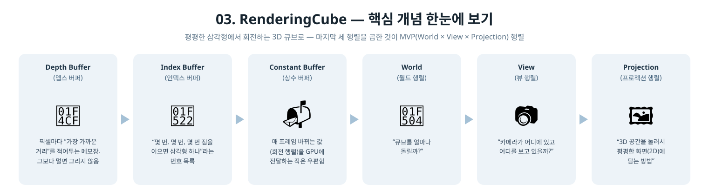

[◀ 이전: 02. RenderingTriangle](../02_RenderingTriangle/README.md) · [🏠 전체 목차](../../README.md) · [다음: 04. TextureMapping ▶](../04_TextureMapping/README.md)

## 03. RenderingCube

  

- 더 쉬운 설명: [GUIDE.md](GUIDE.md)
- 내용: 2단계의 파이프라인에 뎁스 버퍼, 인덱스 버퍼, 루트 CBV(상수 버퍼)를 추가해서 회전하는 3D 큐브를 그립니다.
- 주요 구현:
  - `DXGI_FORMAT_D32_FLOAT` 뎁스 버퍼 + DSV 디스크립터 힙, `DepthStencilState.DepthEnable`로 은면 제거
  - 8개 정점 / 36개 인덱스로 큐브 지오메트리 구성, `IASetIndexBuffer` + `DrawIndexedInstanced`
  - 루트 시그니처에 `D3D12_ROOT_PARAMETER_TYPE_CBV` 파라미터 하나 추가 (디스크립터 힙 없이 `SetGraphicsRootConstantBufferView`로 직접 바인딩)
  - `DirectXMath`로 World(회전) * View(LookAt) * Projection(Perspective) 행렬을 매 프레임 갱신 (`QueryPerformanceCounter` 기반 타이머)
  - 아직 컬링은 켜지 않음 (`D3D12_CULL_MODE_NONE`) — 버텍스 와인딩 순서는 다음 단계에서 다룹니다
- 결과: CornflowerBlue 배경 위에서 큐브가 Y/X축으로 계속 회전하며, 뎁스 테스트로 앞면이 뒷면을 올바르게 가림

  

