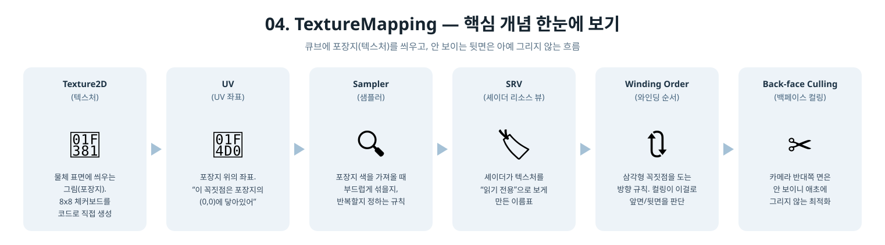
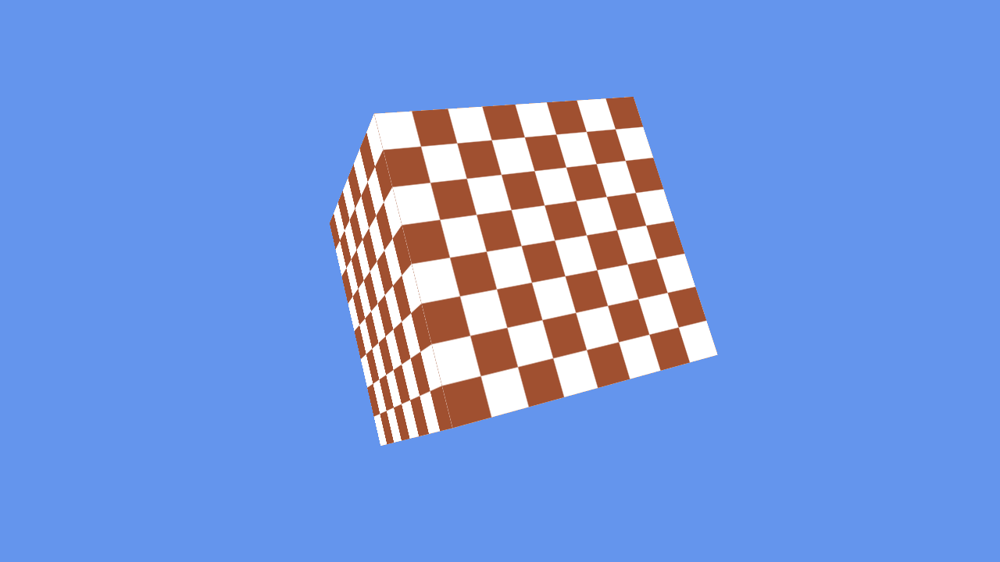

[◀ 이전: 03. RenderingCube](../03_RenderingCube/README.md) · [🏠 전체 목차](../../README.md) · [다음: 05. Lighting ▶](../05_Lighting/README.md)

## 04. TextureMapping

  

- 더 쉬운 설명: [GUIDE.md](GUIDE.md)
- 내용: 3단계의 정점 컬러를 텍스처로 대체하고, 큐브의 버텍스 와인딩을 정리해서 백페이스 컬링을 켭니다.
- 주요 구현:
  - 큐브를 면당 4개(총 24개) 정점으로 재구성해서 각 면이 독립된 0~1 UV를 가지도록 함
  - `D3D12_CULL_MODE_BACK`으로 전환 (와인딩이 맞지 않으면 면이 사라지므로 검증 포인트가 됨)
  - CPU에서 8x8 체커보드를 생성해 `DEFAULT` 힙 텍스처로 업로드 (`GetCopyableFootprints` + `CopyTextureRegion`, 이미지 파일/WIC 의존성 없음)
  - 루트 시그니처에 CBV(b0) + SRV 디스크립터 테이블(t0) + 정적 샘플러(s0) 구성
  - 픽셀 셰이더에서 `Texture2D.Sample`로 체커보드를 샘플링
- 결과: 회전하는 큐브의 각 면에 체커보드 텍스처가 올바르게 매핑되어 표시됨 (컬링이 켜져 있어도 모든 면이 정상적으로 보임 → 와인딩이 올바르다는 뜻)

  

