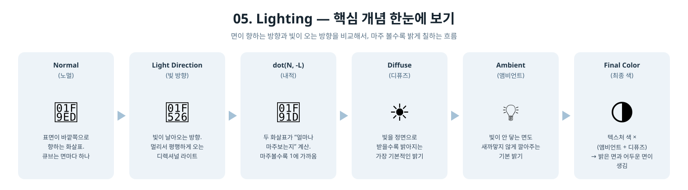

[◀ 이전: 04. TextureMapping](../04_TextureMapping/README.md) · [🏠 전체 목차](../../README.md) · [다음: 06. Lighting_BlinnPhong ▶](../06_Lighting_BlinnPhong/README.md)

## 05. Lighting

  

- 더 쉬운 설명: [GUIDE.md](GUIDE.md)
- 내용: 4단계의 텍스처 큐브에 정점 노멀과 방향광(디렉셔널 라이트)을 추가해서, 빛을 받는 면과 반대편 면의 밝기가 달라지는 간단한 디퓨즈(Lambertian) 라이팅을 구현합니다.
- 주요 구현:
  - `Vertex`에 면당 고정된 플랫 노멀(`NORMAL`) 추가
  - 상수 버퍼에 월드 행렬, 빛 방향, 빛 색상, ambient 색상 추가 (`SceneConstantBuffer`)
  - 정점 셰이더에서 노멀을 월드 공간으로 변환, 픽셀 셰이더에서 `max(dot(normal, -lightDir), 0)`로 디퓨즈 항 계산
  - 텍스처 색 * (ambient + diffuse)로 최종 색 계산
  - 빛은 큐브와 함께 회전하지 않는 고정된 월드 공간 방향광이라, 큐브가 돌아가면서 밝은 면이 바뀜
- 결과: 회전하는 텍스처 큐브에서 빛을 받는 면은 밝고, 반대 면은 어둡게(ambient만 남음) 렌더링됨

  

