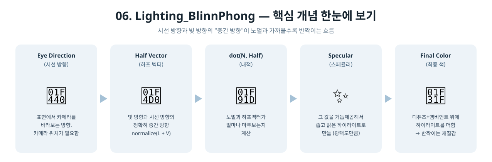

[◀ 이전 가이드: 05. Lighting](../05_Lighting/GUIDE.md) · [🏠 전체 목차](../../README.md) · [다음 가이드: 07. NormalMapping ▶](../07_NormalMapping/GUIDE.md)

# 06. Lighting_BlinnPhong — 이건 어떻게 만들었을까?

5단계에서는 "빛을 마주보는 면은 밝고, 등진 면은 어둡다"까지 만들었어요. 이번엔 여기에
매끈한 플라스틱이나 사과 표면에서 보이는 **반짝이는 하이라이트**를 추가해요.

## 1. 하이라이트는 왜 생길까?

거울처럼 매끈한 표면은 빛을 정확히 한 방향으로만 반사해요. 그 반사 방향이 "마침
내 눈 쪽"을 향할 때만 눈부시게 밝아 보여요. 조금만 각도가 달라져도 반사광은
다른 곳으로 날아가버려서 그 지점은 반짝여 보이지 않아요. 그래서 하이라이트는
- 표면 전체가 아니라
- 아주 좁은 범위에서만

밝게 나타나요.

## 2. Blinn-Phong은 이걸 어떻게 계산할까?

정확한 반사 방향을 계산하는 대신, **더 쉬운 트릭**을 써요.

1. "빛이 오는 반대 방향"(빛 쪽을 향하는 방향)과 "카메라를 향하는 방향"을 더해서
   반으로 나눈 방향 — 이게 **하프 벡터(Half Vector)**예요. 두 방향의 "정중앙"이라고
   생각하면 돼요.
2. 표면의 노멀(화살표)이 이 하프 벡터와 얼마나 가까운지(내적)를 계산해요.
3. 그 값을 제곱, 세제곱, ... (거듭제곱)해서 "많이 가까울 때만 확 밝아지고, 조금만
   벗어나도 급격히 어두워지는" 좁은 하이라이트를 만들어요.

```hlsl
float3 halfVector = normalize(toLight + toEye);
float specularTerm = pow(max(dot(normal, halfVector), 0.0f), specularColor.a);
```

여기서 `specularColor.a`가 **광택도(Shininess)**예요. 숫자가 클수록 하이라이트가
더 좁고 날카로워지고(유리구슬 느낌), 작을수록 넓고 은은해져요(고무공 느낌).

## 3. 등장인물 소개

| 용어 | 비유 |
|---|---|
| 시선 방향 (`toEye`) | 표면에서 카메라를 바라보는 방향 |
| 하프 벡터 (`Half Vector`) | 빛 방향과 시선 방향의 "정확히 중간" 방향 |
| 광택도 (`Shininess`) | 하이라이트가 얼마나 좁고 강하게 뭉치는지 결정하는 숫자 |
| 카메라 위치 (`eyePosition`) | 시선 방향을 계산하려면 꼭 필요한 정보라, 이번에 상수 버퍼에 새로 추가됨 |

<p align="center">
  
</p>

## 4. 실제로 한 일

1. **정점 셰이더가 표면의 월드 좌표도 넘기기** (`VSMain`) — 이전엔 화면 좌표만
   계산했는데, 이번엔 "이 점이 3D 공간에서 실제로 어디 있는지"도 픽셀 셰이더로
   같이 넘겨요. 카메라까지의 방향(시선 방향)을 계산하려면 "지금 여기가 어딘지"를
   알아야 하기 때문이에요.
2. **카메라 위치를 상수 버퍼에 추가** (`SceneConstantBuffer::eyePosition`) — 매 프레임
   카메라 위치를 GPU로 넘겨요.
3. **픽셀 셰이더에서 하프 벡터 계산하고 하이라이트 만들기** (`PSMain`) — 위 공식대로
   계산해서, 디퓨즈+앰비언트로 만든 색 위에 하이라이트를 더해요.
4. **빛을 등진 면은 하이라이트 제거** — 수학적으로는 빛을 등진 면에도 하프 벡터
   계산 자체는 가능해서 어색한 하이라이트가 생길 수 있어요. `NdotL`이 0보다
   작으면(빛을 완전히 등지면) 하이라이트도 강제로 0으로 만들어요.

## 5. 왜 광택도를 낮게(8) 잡았을까?

우리 큐브는 면이 6개뿐이고, 각 면은 하나의 평평한 노멀만 가져요(플랫 셰이딩).
그래서 "노멀이 하프 벡터와 아주 정확히 일치하는 면"이 존재하지 않을 수도 있어요.
광택도를 32, 64처럼 높게 잡으면 하이라이트가 너무 좁아져서, 화면 어디에도 안
보일 수도 있어요. 그래서 이 단계에서는 하이라이트를 넓게 퍼뜨려(광택도 8) 눈에
확실히 보이도록 했어요. 나중에 구(sphere)처럼 매끄럽게 이어지는 노멀을 쓰게 되면
광택도를 훨씬 높여도 하이라이트가 잘 보여요.

## 6. 요약 한 줄

> "빛 방향과 시선 방향의 중간(하프 벡터)이 표면 노멀과 가까운 정도를 거듭제곱해서,
> 좁고 밝은 하이라이트를 디퓨즈 결과 위에 더한" 프로그램.
