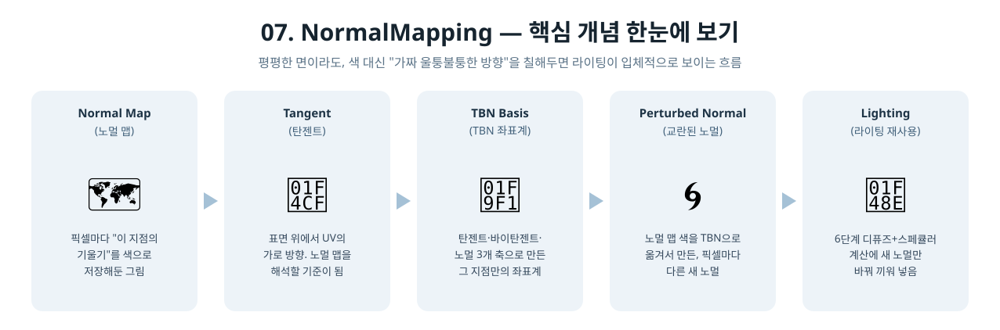

[◀ 이전 가이드: 06. Lighting_BlinnPhong](../06_Lighting_BlinnPhong/GUIDE.md) · [🏠 전체 목차](../../README.md) · [다음 가이드: 08. Skybox ▶](../08_Skybox/GUIDE.md)

# 07. NormalMapping — 이건 어떻게 만들었을까?

6단계까지 큐브의 각 면은 완전히 평평했어요. 면 하나 전체가 노멀(화살표) 하나만
가지니까, 빛도 그 면 전체에 똑같이 계산됐죠. 이번 단계는 "사실은 평평한데,
울퉁불퉁해 보이게" 속이는 기술을 다뤄요.

## 1. 노멀 맵은 무엇을 속이는 걸까?

벽돌 벽이나 오렌지 껍질을 떠올려보세요. 표면 전체를 진짜 울퉁불퉁한 3D 모양으로
만들면 정점이 어마어마하게 많이 필요해요. 대신 이런 트릭을 써요.

- 표면은 그대로 평평하게 둔다 (정점 개수 안 늘림)
- 대신 "이 픽셀에서는 표면이 이 방향을 보는 셈 치자"라는 정보를 그림(텍스처)으로
  저장해둔다
- 라이팅 계산을 할 때, 진짜 노멀 대신 이 그림에서 읽은 "가짜 노멀"을 써서 밝기를 계산한다

빛 계산 자체는 5~6단계와 똑같아요. 다만 "어느 방향을 향한 척 할지"를 픽셀마다
다르게 줄 수 있게 된 거예요.

## 2. 노멀 맵은 어떻게 만들었을까?

이미지 파일을 불러오는 대신, 코드에서 직접 "울퉁불퉁한 높이"를 계산했어요.

1. 8x8 칸마다 사인(sin) 곡선으로 봉긋 솟은 언덕 모양의 높이를 계산해요
   (`heightAt(x, y)`).
2. 옆 픽셀과 높이를 비교해서 "이 지점이 어느 쪽으로 기울어져 있는지" 구해요
   (중심차분, central difference). 오른쪽이 더 높으면 그쪽으로 기울어진 거예요.
3. 그 기울기를 진짜 방향 벡터(노멀)로 바꾸고, `[-1,1]` 범위의 방향값을 `[0,1]`
   범위의 색(R,G,B)으로 바꿔서 텍스처에 저장해요.

이렇게 만든 그림이 흔히 보라/파랑 톤으로 보이는 "노멀 맵"이에요. 여기서는 알아보기
쉽도록 그대로 저장했어요.

## 3. 등장인물 소개

| 용어 | 비유 |
|---|---|
| 노멀 맵 (`Normal Map`) | 픽셀마다 "이 지점의 가짜 기울기"를 색으로 적어둔 그림 |
| 탄젠트 (`Tangent`) | 표면 위에서 UV 좌표의 "가로(U)" 방향. 노멀 맵의 색을 실제 3D 방향으로 바꿀 때 기준이 됨 |
| 바이탄젠트 (`Bitangent`) | 탄젠트와 노멀에 수직인 "세로(V)" 방향. `cross(normal, tangent)`로 계산해서 따로 저장 안 해도 됨 |
| TBN 행렬 | 탄젠트/바이탄젠트/노멀 세 방향을 모아 만든, "이 지점만의 나침반" |
| 교란된 노멀 (Perturbed Normal) | 노멀 맵에서 읽은 값을 TBN으로 옮겨서 만든, 실제 라이팅 계산에 쓰는 새 노멀 |

  

## 4. 실제로 한 일

1. **탄젠트 데이터 추가** (`InitCubeGeometry`) — 각 면의 UV가 가로로 증가하는 방향을
   따라 탄젠트 벡터를 정해서, 노멀처럼 꼭짓점에 같이 넣었어요. 큐브 면이 축에 딱
   맞게 정렬돼 있어서, 탄젠트도 (1,0,0)처럼 깔끔한 축 방향으로 나와요.
2. **노멀 맵 텍스처 만들기** (`InitTextures`) — 위에서 설명한 방식으로 범프 하이트필드를
   계산하고, 방향 벡터를 RGB 색으로 인코딩해서 디퓨즈 텍스처와 함께 GPU로 올려요.
3. **SRV를 2개로 확장** — 이전엔 텍스처가 디퓨즈 하나뿐이라 SRV도 1개였는데, 이번엔
   디퓨즈(t0)와 노멀 맵(t1)을 각각 다른 슬롯에 등록해요.
4. **픽셀 셰이더에서 TBN으로 노멀 교체** (`PSMain`) —
   - 노멀 맵에서 읽은 색을 `색*2-1`로 되돌려서 실제 방향값(`[-1,1]`)으로 복원
   - `float3x3 TBN = float3x3(tangent, bitangent, normal)`로 좌표계를 만들고
   - `mul(tangentSpaceNormal, TBN)`으로 그 방향을 월드 공간으로 옮김
   - 이렇게 얻은 "교란된 노멀"을 6단계와 똑같은 디퓨즈+스페큘러 계산에 그대로 사용

## 5. 결과 화면에서 확인할 수 있는 것

체커보드의 각 사각형 칸 안에서 밝기가 둥글게 변하는 게 보여요. 진짜 표면은
평평한데도, 마치 각 칸이 조금씩 부풀어 오른 것처럼 보이죠. 큐브가 회전하면 이
"가짜 굴곡"도 빛 방향에 맞춰 같이 반응해요.

## 6. 요약 한 줄

> "표면은 평평하게 두고, 픽셀마다 다른 가짜 노멀을 그림(노멀 맵)에서 읽어와서
> 라이팅 계산에 끼워 넣어 울퉁불퉁해 보이게 만든" 프로그램.
