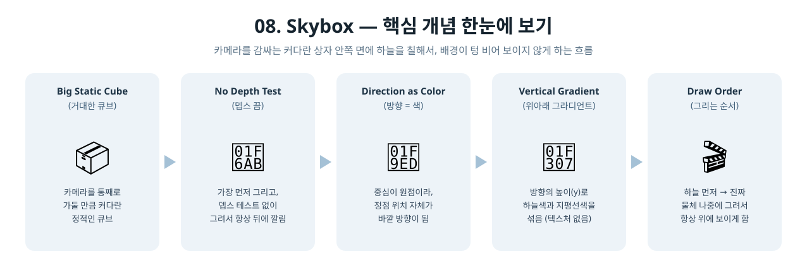

[◀ 이전 가이드: 07. NormalMapping](../07_NormalMapping/GUIDE.md) · [🏠 전체 목차](../../README.md) · [다음 가이드: 09. ShadowMap ▶](../09_ShadowMap/GUIDE.md)

# 08. Skybox — 이건 어떻게 만들었을까?

7단계까지 배경은 그냥 파란 단색이었어요. 이번엔 그 자리에 "하늘처럼 보이는 배경"을
넣어봐요. 진짜 사진이나 3D 세상을 다 만들지 않고도 그럴듯하게 속이는 방법이에요.

## 1. 스카이박스는 무슨 트릭일까?

카메라 주위를 아주 커다란 상자로 감싼다고 생각해보세요. 상자가 카메라보다 훨씬
크면, 카메라는 그 상자 "안"에 갇힌 셈이 돼요. 이제 그 상자 안쪽 벽에 하늘 그림을
그려두면, 카메라 눈에는 진짜로 하늘로 둘러싸인 것처럼 보여요. 실제로는 얇은 상자
안쪽 면일 뿐인데도요!

이번 튜토리얼은 카메라가 한자리에 고정돼 있어서(큐브만 회전), 훨씬 더 단순하게
만들 수 있었어요: 그냥 원점을 중심으로 아주 큰 정적 큐브를 하나 두면, 카메라가
항상 그 안에 있게 돼요. 카메라를 따라다니게 만드는 코드가 필요 없었어요.

## 2. 하늘 그림은 어떻게 그렸을까?

이미지 파일이나 텍스처 없이, 순수하게 수학으로만 하늘을 표현했어요.

- 스카이박스 큐브는 원점이 중심이니까, **정점의 위치 자체가 "중심에서 바깥으로
  향하는 방향"**이에요. 따로 방향을 계산할 필요가 없어요.
- 그 방향의 위아래(y) 성분만 보고, 위쪽일수록 하늘색에 가깝게, 아래쪽(지평선
  방향)일수록 밝은 색에 가깝게 섞어요 (`lerp`).

```hlsl
float t = saturate(direction.y * 0.5f + 0.5f);
float3 color = lerp(horizonColor.rgb, skyColor.rgb, t);
```

## 3. 등장인물 소개

| 용어 | 비유 |
|---|---|
| 스카이박스 (`Skybox`) | 카메라를 감싸는, 안쪽 면에 하늘을 칠한 커다란 상자 |
| 뎁스 테스트 끄기 | "이건 배경이니까 무조건 제일 뒤에 있어야 해" 라고 정해두는 것 |
| 그리는 순서 | 배경(하늘)을 먼저 칠하고, 그 위에 진짜 물체를 그리는 방식 |
| 방향 → 색 변환 | 위치 좌표를 그대로 "이 방향은 무슨 색이어야 하는지" 계산에 사용하는 트릭 |

<p align="center">
  
</p>

## 4. 실제로 한 일

1. **스카이박스 전용 셰이더 작성** (`SkyboxShaders.hlsl`) — 텍스처도, 라이팅도 없이
   정점 위치(방향)만 받아서 하늘색을 계산하는 아주 단순한 셰이더를 새로 만들었어요.
2. **스카이박스 전용 루트 시그니처/PSO** (`InitSkybox`) — 7단계 큐브와 세팅이 많이
   달라서(텍스처 없음, 뎁스 끔, 컬링 끔) 아예 별도의 루트 시그니처와 PSO를 만들었어요.
3. **큰 정적 큐브 지오메트리** — 3단계에서 썼던 8정점짜리 단순한 큐브를 재사용하되,
   스케일을 50배로 키웠어요.
4. **뎁스/컬링 설정** — `DepthEnable = FALSE`로 배경이 항상 맨 뒤에 깔리게 하고,
   `CullMode = NONE`으로 상자 안쪽에서 보더라도 면이 사라지지 않게 했어요.
5. **그리는 순서 정하기** (`Render`) — 매 프레임 스카이박스를 먼저 그리고, 그 다음에
   7단계의 노멀 매핑 큐브를 그려서 항상 위에 겹쳐 보이게 했어요.

## 5. 결과 화면에서 확인할 수 있는 것

배경이 더 이상 단색이 아니라, 위는 파랗고 아래로 갈수록 밝아지는 하늘처럼 보여요.
큐브가 계속 회전해도 배경은 항상 카메라를 감싼 채로 그대로예요 (배경 자체는
회전하지 않으니까요).

## 6. 요약 한 줄

> "카메라를 가둘 만큼 큰 상자를 만들고, 그 안쪽 면에 위치 방향만으로 계산한 하늘색을
> 칠해서, 배경이 텅 비어 보이지 않게 만든" 프로그램.
