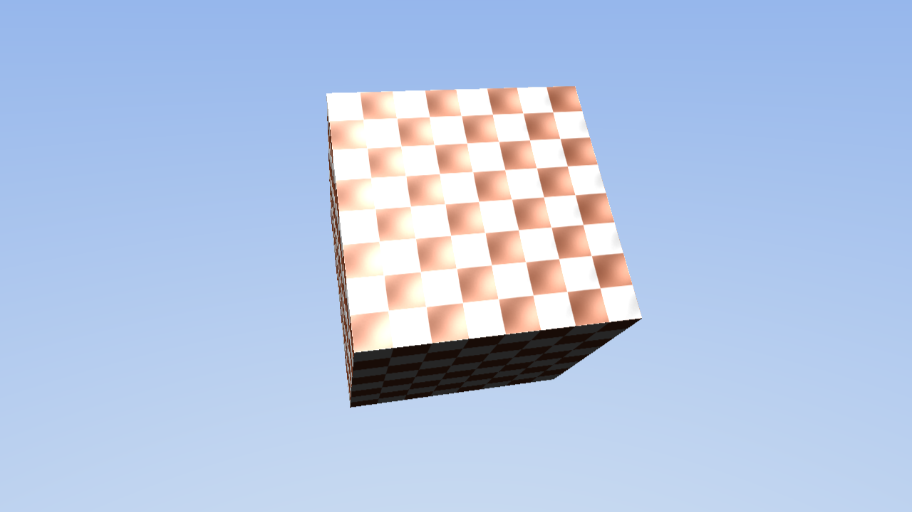

[◀ 이전: 07. NormalMapping](../07_NormalMapping/README.md) · [🏠 전체 목차](../../README.md) · [다음: 09. ShadowMap ▶](../09_ShadowMap/README.md)

## 08. Skybox

  

- 더 쉬운 설명: [GUIDE.md](GUIDE.md)
- 내용: 7단계의 CornflowerBlue 단색 배경 대신, 카메라를 감싸는 커다란 정적 큐브에 절차적 하늘 그라디언트를 그려 배경으로 씁니다.
- 주요 구현:
  - 카메라를 중심에 두지 않고, 카메라가 항상 안쪽에 있도록 월드 원점 기준으로 매우 큰(스케일 50) 정적 큐브를 하나 더 둠 (이 튜토리얼은 카메라가 움직이지 않으므로 이렇게만 해도 충분함)
  - 스카이박스 전용 루트 시그니처/PSO/셰이더(`SkyboxShaders.hlsl`)를 별도로 구성 — 텍스처 없이 정점의 로컬 위치(=중심에서 바깥 방향)만으로 하늘색/지평선색을 보간
  - `DepthEnable = FALSE`로 렌더링해서 항상 배경으로만 깔리게 함, `CullMode = NONE`으로 안쪽 면 컬링 문제를 피함
  - `Render()`에서 스카이박스를 먼저 그리고, 7단계의 노멀 매핑 큐브를 그 다음에 그려서 항상 위에 보이게 함
- 결과: 위는 파랗고 아래로 갈수록 밝아지는 하늘 배경 위에, 회전하는 노멀 매핑 큐브가 그려짐

  

