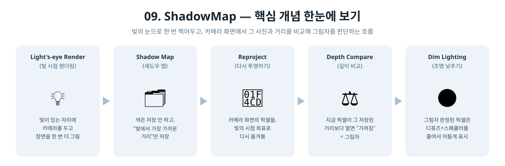
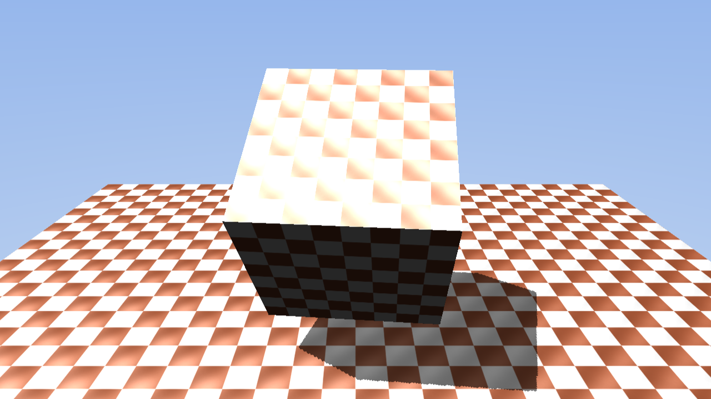

[◀ 이전: 08. Skybox](../08_Skybox/README.md) · [🏠 전체 목차](../../README.md)

## 09. ShadowMap

  

- 더 쉬운 설명: [GUIDE.md](GUIDE.md)
- 내용: 8단계 장면에 바닥 평면을 추가하고, 큐브가 그 위에 실시간 그림자를 드리우게 합니다.
- 주요 구현:
  - 바닥 평면(4정점 큰 사각형, 체커보드 텍스처가 4x4로 반복되도록 UV 조정) 추가
  - 라이트 시점 직교 투영(`XMMatrixOrthographicLH`)으로 별도의 뎁스 온리 셰도우맵(1024×1024, `DXGI_FORMAT_R32_TYPELESS` + DSV/SRV 이중 뷰) 렌더링 — 픽셀 셰이더 없이 정점 셰이더만 사용하는 전용 PSO
  - 각 오브젝트(큐브/평면)마다 독립된 상수 버퍼로 광원 시점 MVP를 별도 계산해서 셰도우 패스에 사용 (하나의 버퍼를 재사용하면 draw call 사이에 값이 덮어써지는 문제를 피하기 위함)
  - 메인 픽셀 셰이더에서 정점의 광원-시점 위치를 다시 받아 셰도우맵 UV로 변환하고, 저장된 깊이와 비교(바이어스 포함)해서 그림자 여부 판정
  - 그림자로 판정된 픽셀은 디퓨즈/스페큘러 항만 낮추고 ambient는 그대로 둬서 완전히 새까맣지 않게 함
  - PCF, 캐스케이드 등은 없음 — 샘플 1번 + 바이어스로 단순화
- 결과: 회전하는 큐브가 바닥 평면 위에 또렷한 그림자를 드리우고, 큐브가 회전해도 그림자 모양이 함께 바뀜

  

