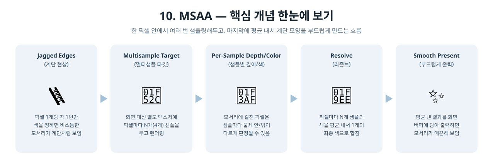
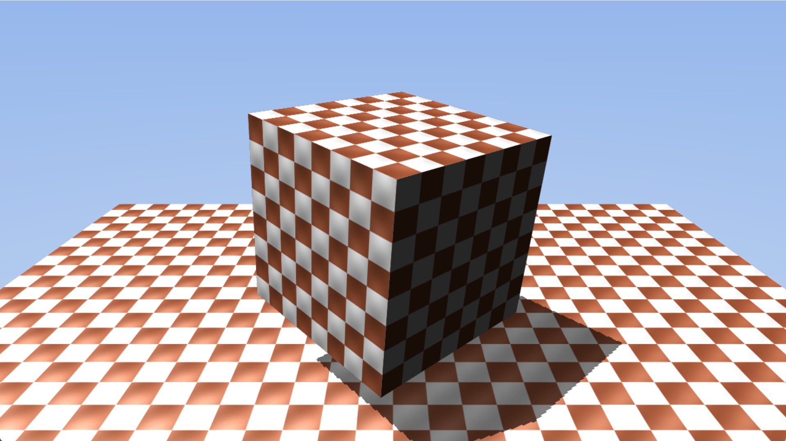

[◀ 이전: 09. ShadowMap](../09_ShadowMap/README.md) · [🏠 전체 목차](../../README.md) · [다음: 11. ComputeShader ▶](../11_ComputeShader/README.md)

## 10. MSAA

  

- 더 쉬운 설명: [GUIDE.md](GUIDE.md)
- 내용: 9단계 장면(하늘 + 큐브 + 그림자 진 바닥)을 그대로 두고, 화면에 보이는 최종 이미지에만 4x MSAA(멀티샘플 안티에일리어싱)를 적용해서 모서리의 계단 현상을 줄입니다.
- 주요 구현:
  - `ID3D12Device::CheckFeatureSupport`로 백버퍼 포맷(`DXGI_FORMAT_R8G8B8A8_UNORM`) 기준 4x MSAA 품질 레벨을 조회하고, 지원되면 4x를, 안 되면(거의 없는 경우) 1x로 자동 대체
  - 플립 모델 스왑체인(`DXGI_SWAP_EFFECT_FLIP_DISCARD`)은 자체적으로 멀티샘플 렌더 타깃이 될 수 없으므로, 별도의 오프스크린 멀티샘플 컬러 리소스(RTV)와 멀티샘플 뎁스 버퍼(DSV)를 새로 만듦
  - 메인 패스(스카이박스 + 큐브 + 바닥 평면)는 그대로 두되, 그리기 대상만 백버퍼가 아니라 이 멀티샘플 컬러/뎁스 타깃으로 바꿈
  - 메인 PSO/스카이박스 PSO의 `SampleDesc`를 멀티샘플 샘플 수에 맞춰 조정 (셰도우맵 전용 PSO는 화면에 직접 나오지 않으므로 그대로 1x 유지)
  - 메인 패스가 끝난 뒤 `ResolveSubresource`로 멀티샘플 컬러 타깃을 그 프레임의 실제 백버퍼로 리졸브(평균)하고, 리소스 상태를 `RESOLVE_SOURCE`/`RESOLVE_DEST` → `PRESENT`로 전환한 뒤 `Present` 호출
- 결과: 9단계와 똑같은 장면이지만, 큐브와 바닥의 모서리 및 그림자 경계가 훨씬 매끈하게 보임

  

