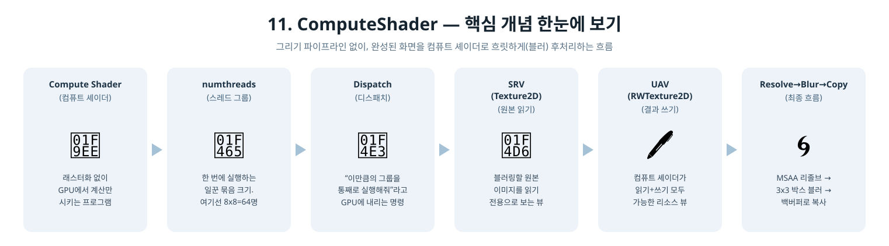
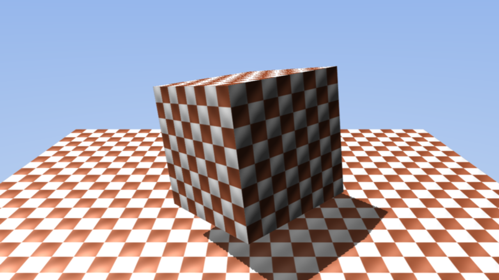

[◀ 이전: 10. MSAA](../10_MSAA/README.md) · [🏠 전체 목차](../../README.md)

## 11. ComputeShader

  

- 더 쉬운 설명: [GUIDE.md](GUIDE.md)
- 내용: 10단계까지 계속 써온 그래픽스(그리기) 파이프라인 옆에, D3D12의 또 다른 축인 컴퓨트 파이프라인을 처음 도입합니다. 완성된 프레임을 컴퓨트 셰이더로 후처리(3x3 박스 블러)해서 화면에 보여줍니다.
- 주요 구현:
  - 컴퓨트 셰이더 전용 SRV(`t0`)+UAV(`u0`) 디스크립터 테이블 하나로 구성된 컴퓨트 루트 시그니처 (`D3D12_SHADER_VISIBILITY_ALL` 필수) 및 `D3D12_COMPUTE_PIPELINE_STATE_DESC` 기반 컴퓨트 PSO
  - MSAA 리졸브 결과를 곧장 백버퍼로 보내는 대신, 별도의 오프스크린 단일 샘플 텍스처(`m_resolvedColorTarget`)로 리졸브
  - `BlurCompute.hlsl`: `[numthreads(8, 8, 1)]` 스레드 그룹으로 픽셀마다 자신+주변 8개(3x3)를 평균 내는 박스 블러, `RWTexture2D` UAV에 결과를 씀
  - `Dispatch((width+7)/8, (height+7)/8, 1)`로 이미지 전체를 스레드 그룹 격자로 덮고, 셰이더 안에서 화면 밖으로 넘친 스레드는 조기 종료
  - 블러 결과 텍스처를 `CopyResource`로 그 프레임의 백버퍼에 복사한 뒤 `Present` (셰이더나 렌더 타깃 없이 순수 GPU 복사)
- 결과: 10단계와 같은 장면(회전하는 큐브, 그림자, 하늘 배경)이지만, 체크무늬 표면과 바닥의 경계가 전체적으로 부드럽게 번져 보임 (MSAA는 도형 모서리만 다듬지만, 이번 블러는 이미지 전체에 적용되는 후처리)

  

