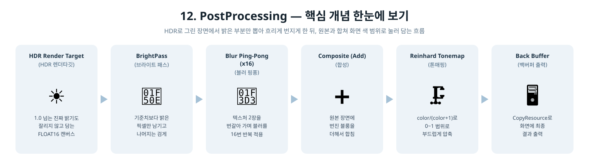
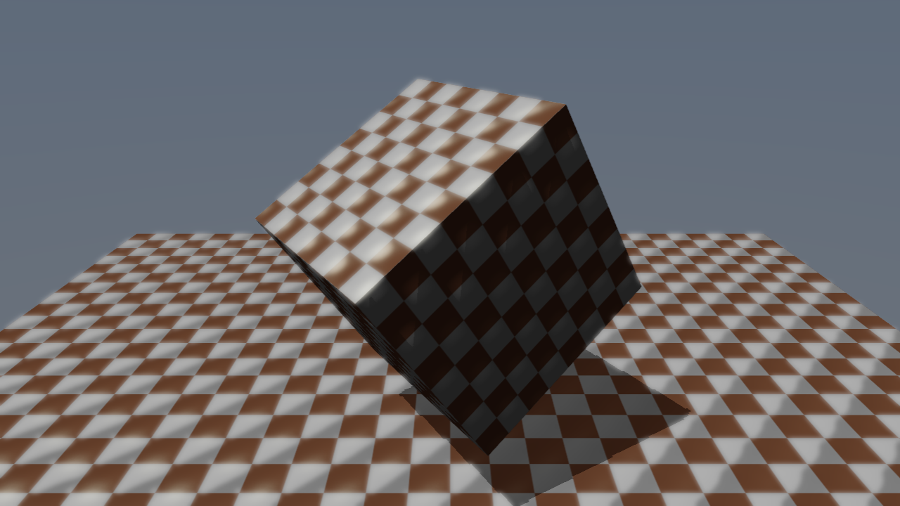

[◀ 이전: 11. ComputeShader](../11_ComputeShader/README.md) · [🏠 전체 목차](../../README.md) · [다음: 13. PBRMaterials ▶](../13_PBRMaterials/README.md)

## 12. PostProcessing

  

- 더 쉬운 설명: [GUIDE.md](GUIDE.md)
- 내용: 11단계의 컴퓨트 파이프라인을 실제 후처리 효과로 발전시켜, 오프스크린 HDR 렌더타깃 → 블룸(밝은 부분 추출 + 반복 블러) → Reinhard 톤매핑 → 백버퍼 출력의 완전한 HDR 포스트 프로세싱 체인을 구현합니다.
- 주요 구현:
  - 메인 MSAA 컬러 타깃과 PSO의 렌더 타깃 포맷을 `R8G8B8A8_UNORM`에서 `R16G16B16A16_FLOAT`(HDR)로 전환해서, 1.0을 넘는 스페큘러 하이라이트 값이 클리핑되지 않게 함
  - `BrightPass.hlsl`: 휘도가 임계값(1.0)을 넘는 픽셀만 남기고 나머지는 0으로 지우는 컴퓨트 셰이더
  - 11단계와 동일한 `BlurCompute.hlsl`을 재사용해, 두 개의 HDR 텍스처(`m_bloomTargetA/B`) 사이를 핑퐁하며 `BloomBlurIterations`(16)회 반복 블러 → 좁은 3x3 커널로도 넓은 블룸 halo 효과
  - `Tonemap.hlsl`: 장면(SRV t0) + 최종 블룸(SRV t1)을 더한 뒤 `color/(color+1)` Reinhard 공식으로 LDR UAV(u0)에 압축
  - 컴퓨트 셰이더 3종(브라이트 패스/블러/톤매핑)이 공유하는 디스크립터 힙 하나에 9개 SRV/UAV를 고정 오프셋으로 배치해, `Render()`가 매 디스패치마다 알맞은 테이블 시작 핸들만 골라 바인딩
  - 최종 톤매핑 결과를 `CopyResource`로 백버퍼에 복사한 뒤 `Present`
- 결과: 11단계와 같은 장면(회전하는 큐브, 그림자, 하늘 배경)이지만, 큐브 표면의 밝은 하이라이트 주변이 은은하게 빛나며 큐브 실루엣 밖(배경)까지 부드럽게 번지는 블룸 효과가 나타남

  

