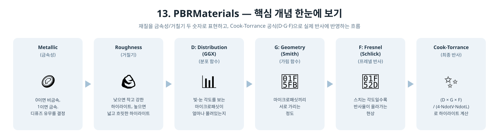

[◀ 이전 가이드: 12. PostProcessing](../12_PostProcessing/GUIDE.md) · [⬆ 상위로 돌아가기](README.md) · [🏠 전체 목차](../../README.md) · [다음 가이드: 14. BindlessResources ▶](../14_BindlessResources/GUIDE.md)

# 13. PBRMaterials — 이건 어떻게 만들었을까?

6단계부터 지금까지 큐브와 바닥은 항상 같은 방식으로 빛났어요: 정면으로 빛을 받을수록
밝아지는 디퓨즈, 그리고 "얼마나 반짝이는지"를 shininess 숫자 하나로 정한 스페큘러
하이라이트(Blinn-Phong). 이번 단계는 이 조명 계산 자체를 통째로 **PBR(물리 기반
렌더링)**로 바꿔봐요.

## 1. Blinn-Phong은 뭐가 아쉬웠을까?

Blinn-Phong의 "얼마나 반짝이는지" 숫자(shininess)나 "하이라이트 색"은 사실 딱히
물리적인 근거가 없는, 눈으로 보기에 그럴싸하면 그만인 숫자였어요. 그래서 "이 재질은
금속이다" / "이 재질은 플라스틱이다"를 표현하려면 매번 감으로 숫자를 조정해야
했어요.

PBR은 대신 사람이 실제로 이해하기 쉬운 두 가지 숫자로 재질을 표현해요.

| 파라미터 | 뜻 |
|---|---|
| 금속성 (`Metallic`, 0~1) | 이 표면이 금속이냐 아니냐. 1이면 완전한 금속(구리, 철 같은), 0이면 플라스틱/나무/돌 같은 비금속 |
| 거칠기 (`Roughness`, 0~1) | 표면이 얼마나 거친가. 0이면 거울처럼 매끈해서 하이라이트가 아주 작고 강하게, 1이면 반들거림 없이 넓고 흐릿하게 |

숫자 두 개만으로 "이건 광택 나는 금속 큐브, 저건 좀 거친 플라스틱 바닥"처럼 직관적으로
재질을 정할 수 있어요.

## 2. 금속과 비금속은 뭐가 다르게 빛날까?

- **비금속(플라스틱, 나무, 돌...)**: 빛을 표면 아래로 살짝 파고들었다가 사방으로
  흩뿌리는 **디퓨즈** 반사가 대부분이고, 스페큘러 하이라이트는 색 없이 그냥
  하얗게 옅은 정도예요.
- **금속(철, 구리, 금...)**: 빛이 표면 아래로 파고들지 못하고 바로 튕겨 나가서,
  디퓨즈가 거의 없어요. 대신 반사되는 하이라이트가 그 금속 고유의 색으로 물들어요
  (금색 하이라이트, 구리색 하이라이트처럼).

이번 단계 예제에서는 **큐브를 금속(금속성 0.9)**, **바닥을 비금속(금속성 0)**으로
설정해서 이 차이가 눈으로 뚜렷이 보이게 했어요.

## 3. Cook-Torrance는 이걸 어떻게 계산할까?

PBR에서 가장 널리 쓰이는 공식이 **Cook-Torrance**예요. 이름은 복잡해 보이지만
아이디어는 "표면은 매끈해 보여도 사실 아주 작은 오돌토돌한 거울 조각(마이크로패싯)들의
집합이다"라는 거예요. 이 공식은 세 조각으로 나뉘어요.

| 조각 | 이름 | 하는 일 |
|---|---|---|
| D | 분포(`DistributionGGX`) | 빛과 눈 사이 정확히 절반 각도를 보는 거울 조각이 얼마나 많은지. 거칠기가 낮을수록 이 각도에 조각들이 몰려있어서 하이라이트가 작고 강해짐 |
| G | 가림(`GeometrySmith`) | 거울 조각들끼리 서로를 가리거나 그림자를 드리우는 정도 |
| F | 프레넬(`FresnelSchlick`) | 보는 각도에 따라 반사율이 달라지는 정도. 정면에서 보면 원래 색, 옆에서 스치듯 보면 어떤 재질이든 거울처럼 반사율이 확 올라감 |

이 세 개를 곱하고 나누면 스페큘러 하이라이트의 밝기가 나와요.

```hlsl
specular = (D * G * F) / (4 * NdotV * NdotL);
```

## 4. 등장인물 소개

| 용어 | 비유 |
|---|---|
| 금속성 (`Metallic`) | "이 표면이 금속이냐"를 0~1로 나타낸 숫자. 1이면 디퓨즈가 거의 사라지고 하이라이트가 표면 색으로 물듦 |
| 거칠기 (`Roughness`) | 표면이 얼마나 오돌토돌한지. 낮으면 작고 강한 하이라이트, 높으면 넓고 흐릿한 하이라이트 |
| 분포 함수 (D, GGX) | 빛-눈 사이 각도를 정확히 보는 마이크로패싯이 얼마나 몰려있는지 |
| 가림 함수 (G, Smith) | 마이크로패싯끼리 서로 가리는 정도 |
| 프레넬 (F, Schlick) | 보는 각도가 스칠수록 반사율이 올라가는 현상 |
| F0 (기본 반사율) | 정면에서 볼 때의 반사율. 비금속은 항상 약 4%(0.04), 금속은 자기 색(albedo) 그대로 |

<p align="center">
  
</p>

## 5. 실제로 한 일

1. **상수 버퍼 교체** (`App.h`) — `specularColor`(색+shininess) 필드를
   `materialParams`(x=금속성, y=거칠기)로 바꿨어요.
2. **Cook-Torrance BRDF 작성** (`Shaders.hlsl`) — `DistributionGGX`,
   `GeometrySmith`, `FresnelSchlick` 세 함수를 만들고, `PSMain`에서 이걸 조합해
   스페큘러를 계산해요.
3. **금속은 디퓨즈가 없다는 걸 코드로 표현** (`Shaders.hlsl`) — 반사되지 않고 남은
   빛의 비율(`kD`)에 `(1 - metallic)`을 곱해서, 금속성이 1에 가까울수록 디퓨즈가
   저절로 0에 가까워지게 만들었어요.
4. **F0(기본 반사율)를 재질에 따라 다르게** (`Shaders.hlsl`) — `lerp(0.04, albedo,
   metallic)`로, 비금속은 항상 약한 흰색 반사율을, 금속은 자기 텍스처 색 그대로의
   반사율을 갖게 했어요.
5. **큐브·바닥에 서로 다른 재질 지정** (`Update`) — 큐브는 금속성 0.9 · 거칠기 0.4로
   반짝이는 금속처럼, 바닥은 금속성 0 · 거칠기 0.7로 무광 플라스틱처럼 설정했어요.
6. **조명 밝기 재조정** (`Update`) — Cook-Torrance의 디퓨즈 항은 `/PI`로 나눠서
   기존 Blinn-Phong보다 어두워지는 경향이 있어서, 전체적인 장면 밝기가 이전 단계와
   비슷하게 보이도록 빛 색과 앰비언트 값을 다시 조정했어요.

## 6. 왜 금속 큐브는 (하이라이트를 빼면) 거의 새까맣게 보일까?

3번에서 말했듯, 완전한 금속은 디퓨즈가 없어요. 그런데 진짜 금속 물체가 어둡게 안
보이는 이유는, 주변 환경(하늘, 바닥, 다른 물체)이 그 표면에 반사돼서 은은하게
비치기 때문이에요. 이런 "주변 반사"를 IBL(Image-Based Lighting)이라고 하는데,
이번 단계에서는 아직 안 만들었어요(다음 로드맵에서 다룰 예정). 그래서 지금은 그
자리를 대신할 앰비언트 값을 살짝 올려서, 금속 큐브가 하이라이트 없는 부분에서도
텍스처가 보일 정도로만 밝게 만들어뒀어요.

## 7. 결과 화면에서 확인할 수 있는 것

같은 체크무늬 텍스처를 쓰는데도, 큐브와 바닥이 완전히 다른 재질처럼 보여요. 큐브는
표면 각도에 따라 반짝이는 하이라이트가 움직이면서 마치 브러시드 메탈(광택 금속)
같은 느낌을 주고, 바닥은 무난한 무광 재질처럼 은은하게 빛을 받아요. 12단계의
블룸도 그대로 남아있어서, 큐브의 강한 하이라이트 주변이 살짝 은은하게 번지는 것도
볼 수 있어요.

## 8. 요약 한 줄

> "재질을 shininess 하나가 아니라 금속성 + 거칠기 두 숫자로 표현하고, Cook-Torrance
> 공식(D·G·F)으로 그 두 숫자가 실제 반사에 어떻게 반영되는지 계산한" 프로그램.

다음 단계부터는 렌더링 결과 자체보다 D3D12를 "제대로 쓰는" 아키텍처 패턴들 -
Bindless 리소스, 멀티스레드 렌더링 - 을 다뤄봐요.
