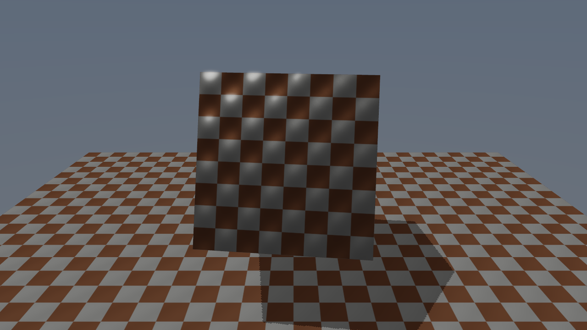

[◀ 이전: 12. PostProcessing](../12_PostProcessing/README.md) · [🏠 전체 목차](../../README.md) · [다음: 14. BindlessResources ▶](../14_BindlessResources/README.md)

## 13. PBRMaterials

  

- 더 쉬운 설명: [GUIDE.md](GUIDE.md)
- 내용: 6단계부터 써온 Blinn-Phong 조명 모델을 금속성(Metallic)/거칠기(Roughness) 기반의 Cook-Torrance PBR BRDF로 교체합니다. 같은 체크무늬 텍스처를 쓰는 큐브(금속)와 바닥(비금속)이 서로 다른 재질로 보이는 것을 확인할 수 있습니다.
- 주요 구현:
  - `SceneConstantBuffer`의 `specularColor`(색+shininess)를 `materialParams`(x=metallic, y=roughness)로 교체
  - `Shaders.hlsl`에 Cook-Torrance BRDF 3요소 구현: `DistributionGGX`(D, 마이크로패싯 분포), `GeometrySmith`(G, Schlick-GGX 가림 함수), `FresnelSchlick`(F, 각도별 반사율)
  - F0(기본 반사율)를 `lerp(0.04, albedo, metallic)`로 계산해서, 비금속은 낮고 균일한 반사율을, 금속은 자기 텍스처 색으로 물든 반사율을 갖게 함
  - 디퓨즈 항의 기여도(`kD`)에 `(1 - metallic)`을 곱해, 금속성이 1에 가까울수록 디퓨즈가 자동으로 사라지도록 함 (금속은 디퓨즈가 없다는 물리적 사실을 그대로 반영)
  - 큐브(metallic 0.9, roughness 0.4)와 바닥(metallic 0.0, roughness 0.7)에 서로 다른 재질 파라미터를 지정하고, Cook-Torrance 디퓨즈의 `/PI` 정규화에 맞춰 조명 밝기를 재조정
- 결과: 같은 텍스처를 쓰지만 큐브는 각도에 따라 움직이는 강한 하이라이트를 가진 광택 금속처럼, 바닥은 무광 플라스틱처럼 보임. 12단계의 블룸 효과도 그대로 유지되어 큐브의 하이라이트 주변이 은은하게 번짐

  

