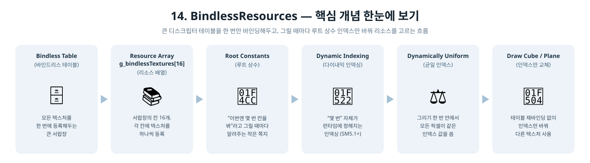

[◀ 이전 가이드: 13. PBRMaterials](../13_PBRMaterials/GUIDE.md) · [⬆ 상위로 돌아가기](README.md) · [🏠 전체 목차](../../README.md) · [다음 가이드: 15. MultiThreadedRendering ▶](../15_MultiThreadedRendering/GUIDE.md)

# 14. BindlessResources — 이건 어떻게 만들었을까?

4단계부터 지금까지, 큐브를 그릴 때와 바닥을 그릴 때 텍스처를 바꿔 낀 적이 한 번도
없었어요. 둘 다 항상 같은 디퓨즈/노멀맵/그림자맵을 봤거든요. 이번 단계는 일부러
"큐브랑 바닥이 서로 다른 텍스처를 쓰게" 만들고, 그걸 CPU가 디스크립터 테이블을
매번 바꿔 끼우지 않고도 해내는 **Bindless(바인드리스)** 구조를 배워봐요.

## 1. 지금까지는 텍스처를 어떻게 바꿔 껴왔을까?

4단계부터 13단계까지, 큐브를 그릴 차례가 되면 "이 3개 텍스처(디퓨즈/노멀/그림자)를
봐"라고 디스크립터 테이블 하나를 통째로 GPU에 알려줬어요. 만약 바닥에 다른
텍스처를 쓰고 싶었다면, 바닥을 그리기 직전에 또 다른 디스크립터 테이블을 만들어서
다시 알려줘야 했을 거예요. 오브젝트 종류가 늘어날수록 "그릴 때마다 테이블 다시
세팅하기"가 반복되는 거죠.

## 2. Bindless는 뭐가 다를까?

아이디어는 단순해요: **테이블은 딱 한 번만 통째로 묶어서 GPU에 알려주고, "이번엔
그중 몇 번을 볼지"만 매번 살짝 알려주자**는 거예요.

1. 모든 텍스처(디퓨즈 2개, 노멀맵, 그림자맵)를 큰 디스크립터 테이블 하나에 전부
   등록해요 - 이게 "바인드리스 테이블"이에요.
2. 이 테이블은 그림 그리는 내내 딱 한 번만 GPU에 알려줘요.
3. 큐브를 그릴 땐 "디퓨즈는 0번, 노멀은 2번, 그림자는 3번 봐"라고 아주 작은 숫자
   4개(루트 상수)만 알려주고, 바닥을 그릴 땐 "디퓨즈만 1번으로 바꿔서 봐"라고
   또 작은 숫자 4개만 알려줘요.

테이블 자체를 다시 세팅하는 게 아니라, "몇 번을 볼지" 인덱스만 휙 바꾸는 거라서
훨씬 가벼워요.

## 3. 왜 "완전한" Bindless는 아직 아닐까?

요즘 최신 GPU(DirectX 12 Ultimate급)는 SM6.6이라는 셰이더 모델에서
`ResourceDescriptorHeap[]`라는 문법으로, 디스크립터 힙 전체를 아무 제약 없이
바로 인덱싱할 수 있어요. 다만 이건 최신 컴파일러(DXC)와 비교적 최근 하드웨어가
있어야만 동작해요.

이 튜토리얼은 누구 컴퓨터에서든 돌아가야 하니까, 대신 로드맵에 적힌 대안인 **"큰
디스크립터 테이블"**로 같은 개념을 구현했어요. Shader Model 5.1의 "크기가 정해진
리소스 배열"(`Texture2D g_bindlessTextures[16]`) 기능을 써서, 사실상 같은 효과를
훨씬 널리 호환되는 방식으로 얻는 거예요.

## 4. 등장인물 소개

| 용어 | 비유 |
|---|---|
| 바인드리스 테이블 | 모든 텍스처를 한 번에 등록해두는 큰 서랍장. 그림 그리는 내내 한 번만 GPU에 보여줌 |
| 리소스 배열 (`Texture2D g_bindlessTextures[16]`) | 서랍장의 칸 16개. 각 칸에 텍스처를 하나씩 등록 |
| 루트 상수 (`BindlessMaterialIndices`) | "이번엔 몇 번 칸을 봐"라고 그릴 때마다 살짝 알려주는 작은 쪽지 |
| 다이내믹 인덱싱 | 셰이더 코드 안에서 "몇 번" 자체가 변수(런타임에 정해짐)인 인덱싱. SM5.1부터 지원 |
| Dynamically Uniform 인덱스 | 그리기 한 번 안에서는 모든 픽셀이 똑같은 인덱스 값을 씀 - 그래서 `NonUniformResourceIndex()` 없이 그냥 인덱싱해도 안전함 |

  

## 5. 실제로 한 일

1. **두 번째 디퓨즈 텍스처 추가** (`InitTextures`) — 큐브는 기존 갈색/흰색
   체크무늬, 바닥은 새로 만든 청록색/흰색 체크무늬를 쓰게 했어요. 이렇게 해야
   "인덱스를 다르게 주면 진짜로 다른 게 보인다"는 걸 눈으로 확인할 수 있어요.
2. **디스크립터 힙을 넉넉하게** (`InitTextures`) — 힙 크기를 정확히 4개가 아니라
   `BindlessHeapCapacity`(16)로 만들고, 실제로는 앞의 4칸(큐브 디퓨즈, 바닥
   디퓨즈, 노멀맵, 그림자맵)만 채웠어요. 나머지 12칸은 비워둔 채로 - 진짜
   바인드리스 힙도 항상 이렇게 "당장 안 쓰는 여유 공간"을 넉넉히 갖고 시작해요.
3. **루트 시그니처에 루트 상수 추가** (`InitRootSignature`) — CBV(b0) 다음에
   `BindlessMaterialIndices` 4개짜리 32비트 루트 상수(b1)를 추가하고, SRV
   테이블도 3개가 아니라 16개짜리로 늘렸어요.
4. **셰이더를 리소스 배열로 전환** (`Shaders.hlsl`) — `Texture2D g_diffuseTexture`
   처럼 이름 붙은 텍스처 3개 대신, `Texture2D g_bindlessTextures[16]` 배열
   하나와 그 인덱스를 담은 `MaterialIndices` cbuffer로 바꿨어요.
5. **셰이더 모델을 5.1로** (`InitPipelineState`) — 리소스 배열을 런타임 값으로
   인덱싱하려면 SM5.1이 필요해서, 메인 패스 셰이더의 컴파일 타깃을
   `vs_5_0`/`ps_5_0`에서 `vs_5_1`/`ps_5_1`로 올렸어요. 컴파일러는 그대로
   `D3DCompileFromFile`이에요 - SM6.6과 달리 새 컴파일러(DXC)가 필요 없어요.
6. **그리기 순서 변경** (`Render`) — 디스크립터 테이블은 큐브/바닥을 그리기 전에
   딱 한 번만 바인딩하고, 큐브 차례엔 `{디퓨즈=0, 노멀=2, 그림자=3}`을, 바닥
   차례엔 `{디퓨즈=1, 노멀=2, 그림자=3}`을 루트 상수로 넘겨요.

## 6. 왜 `NonUniformResourceIndex()`가 필요 없을까?

리소스 배열을 인덱싱할 때 흔히 나오는 주의사항이 `NonUniformResourceIndex()`인데,
이건 "같은 그리기 명령 안에서 픽셀마다 인덱스가 다를 수 있을 때"(예: G-버퍼에서
읽은 재질 ID로 인덱싱)만 필요해요. 여기선 인덱스가 **루트 상수**라서, 큐브를 그리는
동안에는 모든 픽셀이 항상 같은 값을 봐요(dynamically uniform). 그래서 그냥
인덱싱해도 안전하고 빨라요.

## 7. 결과 화면에서 확인할 수 있는 것

큐브는 여전히 갈색/흰색 체크무늬(금속 재질)로, 바닥은 이번에 새로 추가한
청록색/흰색 체크무늬(비금속 재질)로 보여요. 둘 다 같은 디스크립터 테이블이
바인딩된 채로 그려졌는데도 완전히 다른 텍스처가 나온다는 게, 바로 인덱스만으로
리소스를 고르는 바인드리스 패턴이 실제로 동작하고 있다는 증거예요.

## 8. 요약 한 줄

> "텍스처마다 디스크립터 테이블을 새로 바인딩하는 대신, 텍스처를 전부 담은 큰
> 테이블을 한 번만 바인딩해두고, 그릴 때마다 '몇 번을 볼지' 작은 인덱스만
> 루트 상수로 바꿔 넘긴" 프로그램.

다음 단계에서는 이 렌더링 결과를 여러 워커 스레드가 나눠서 커맨드 리스트에
기록하고, 메인 스레드가 한 번에 모아 제출하는 멀티스레드 렌더링을 다뤄봐요.
