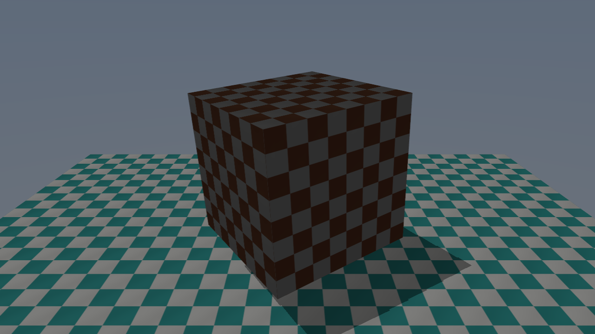

[◀ 이전: 13. PBRMaterials](../13_PBRMaterials/README.md) · [🏠 전체 목차](../../README.md)

## 14. BindlessResources

  

- 더 쉬운 설명: [GUIDE.md](GUIDE.md)
- 내용: 4~13단계에서 그리기마다 고정으로 바인딩하던 3개짜리 SRV 디스크립터 테이블을, 하나의 큰 바인드리스 테이블 + 그리기별 루트 상수 인덱스로 교체합니다. 큐브와 바닥이 서로 다른 디퓨즈 텍스처를 쓰도록 추가해서, 디스크립터 테이블을 다시 바인딩하지 않고도 인덱스만으로 리소스를 골라 쓰는 것을 눈으로 확인할 수 있습니다.
- 주요 구현:
  - `Shaders.hlsl`: `Texture2D g_diffuseTexture/g_normalMap/g_shadowMap` 3개를 `Texture2D g_bindlessTextures[16]` 리소스 배열 하나로 교체하고, `MaterialIndices` cbuffer(b1)의 런타임 인덱스로 접근
  - 루트 시그니처에 `D3D12_ROOT_PARAMETER_TYPE_32BIT_CONSTANTS`(b1, `BindlessMaterialIndices` 4개 값) 추가, SRV 테이블 크기를 3 → `BindlessHeapCapacity`(16)로 확장 (Resource Binding Tier 2 호환을 위해 완전한 unbounded(-1) 대신 고정 크기 사용)
  - 셰이더 컴파일 타깃을 `vs_5_0`/`ps_5_0` → `vs_5_1`/`ps_5_1`로 승격 (리소스 배열의 런타임 인덱싱에 SM5.1 필요, 컴파일러는 기존과 동일한 `D3DCompileFromFile`)
  - 두 번째 디퓨즈 텍스처(청록색/흰색 체크무늬)를 절차적으로 생성해서 바닥에 배정, 바인드리스 힙 인덱스 0=큐브 디퓨즈, 1=바닥 디퓨즈, 2=노멀맵, 3=그림자맵으로 배치
  - `Render()`에서 디스크립터 테이블은 한 번만 바인딩하고, 큐브/바닥을 그리기 직전 `SetGraphicsRoot32BitConstants`로 인덱스만 바꿔 전달
- 결과: 큐브는 기존 갈색/흰색 체크무늬(금속 재질), 바닥은 새로운 청록색/흰색 체크무늬(비금속 재질)로 렌더링됨. 같은 디스크립터 테이블이 바인딩된 채로 두 오브젝트가 서로 다른 텍스처를 쓰는 것이 바인드리스 인덱싱이 실제로 동작하는 증거

  

