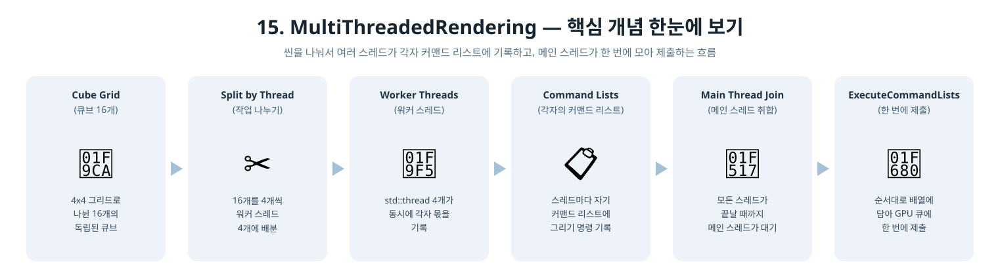
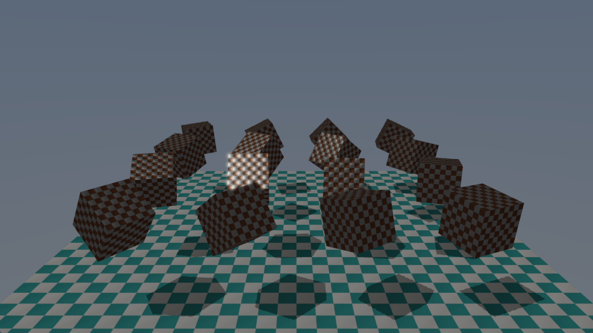

[◀ 이전: 14. BindlessResources](../14_BindlessResources/README.md) · [🏠 전체 목차](../../README.md)

## 15. MultiThreadedRendering

  

- 더 쉬운 설명: [GUIDE.md](GUIDE.md)
- 내용: 1~14단계에서 계속 그려온 큐브 1개를 4x4 그리드(16개)로 늘리고, 그 큐브들의 그리기 명령을 4개의 워커 스레드가 나눠서 각자 독립된 커맨드 리스트에 기록하도록 바꿉니다. 메인 스레드는 그림자맵/스카이박스/바닥을 그리고, 워커 스레드들을 기다렸다가, 모든 커맨드 리스트를 순서대로 배열에 담아 `ExecuteCommandLists` 한 번으로 제출합니다.
- 주요 구현:
  - 큐브를 CubeGridDim(4) x CubeGridDim(4) = CubeCount(16)개로 늘리고, 각 큐브의 월드 행렬용 상수 버퍼를 CubeCount개짜리 배열 하나(256바이트씩 정렬)로 관리 (`m_cubeConstantBuffers`, `CubeConstantBufferAddress`)
  - `InitCommandList`에서 워커 스레드 수(WorkerThreadCount=4)만큼 커맨드 얼로케이터/리스트 쌍을 미리 만들고, 후처리(리졸브+블룸+톤매핑) 전용 커맨드 리스트(`m_postCommandList`)도 별도로 추가
  - `Render()`: 메인 커맨드 리스트가 그림자 패스 + 색상 패스의 클리어/스카이박스/바닥까지 기록하고 `Close()` → `std::thread` 4개를 띄워 `RecordWorkerCommandList`를 병렬 실행 → `join()`으로 전부 끝나길 기다림 → 후처리 커맨드 리스트에 리졸브~톤매핑 기록
  - `RecordWorkerCommandList(threadIndex)`: 자기 몫의 큐브 4개를 그리기 위해 렌더타깃/뷰포트/루트 시그니처/PSO/디스크립터 힙을 처음부터 다시 설정(커맨드 리스트는 서로 상태를 공유하지 않음) 후 `DrawIndexedInstanced` 반복
  - `ExecuteCommandLists`에 [메인 리스트, 워커 리스트 4개, 후처리 리스트] 총 6개를 순서대로 담아 한 번에 제출 - GPU는 이 배열 순서 그대로 실행
- 결과: 4x4로 늘어난 큐브들이 각자 다른 위상으로 회전하며, 그림자와 블룸/톤맵은 이전 단계와 동일하게 정상 동작. CPU 쪽에서 큐브 그리기 명령 기록이 4개 스레드로 병렬화된 것이 핵심 변화

  

