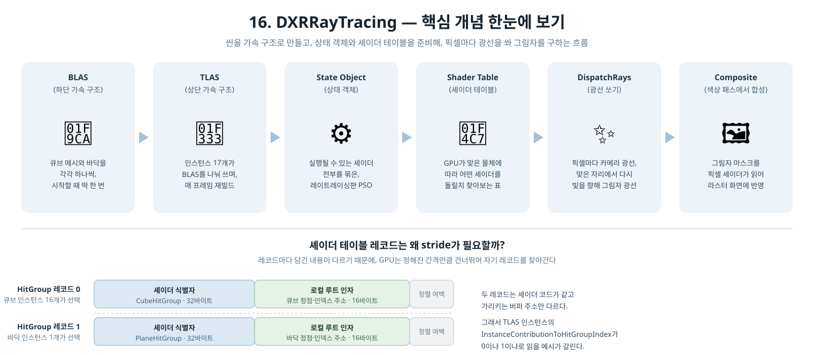
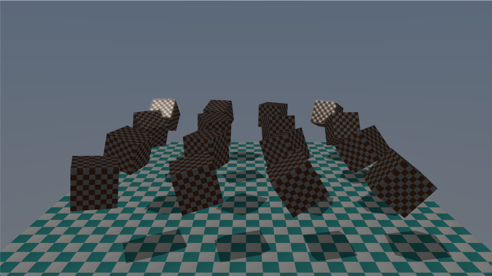

[◀ 이전: 15. MultiThreadedRendering](../15_MultiThreadedRendering/README.md) · [🏠 전체 목차](../../README.md)

## 16. DXRRayTracing

  

- 더 쉬운 설명: [GUIDE.md](GUIDE.md)
- 내용: 9단계부터 써온 셰도우맵 옆에 **DXR 1.0 정석 파이프라인**으로 만든 레이트레이싱 그림자를 나란히 붙입니다. 가속 구조(BLAS/TLAS)를 만들고, 상태 객체와 셰이더 테이블을 준비해 `DispatchRays`로 화면 크기 그림자 마스크를 만든 뒤, 기존 라스터 색상 패스가 그 마스크를 읽어 그림자를 그립니다. **F키**로 두 기법을 즉시 전환해 같은 장면에서 차이를 볼 수 있습니다. 1~15단계의 MSAA·HDR 블룸·톤매핑·바인드리스·PBR·워커 스레드 4개는 그대로 유지됩니다.
- 요구 사항: DXR Tier 1.0 이상을 지원하는 GPU (GeForce RTX 2000 시리즈 이후 또는 동급 AMD/Intel). 지원하지 않으면 시작 시 안내 메시지를 띄우고 종료합니다.
- 주요 구현:
  - `InitRaytracingSupport()`: `ID3D12Device5`를 QueryInterface로 얻고 `D3D12_FEATURE_D3D12_OPTIONS5.RaytracingTier`를 확인. DXR의 모든 진입점이 기본 `ID3D12Device`가 아닌 `ID3D12Device5`에 있어서, 이 단계에서 처음으로 인터페이스 승격이 필요해집니다
  - `InitRaytracingAccelerationStructures()`: 큐브·바닥 메시마다 BLAS를 하나씩 시작할 때 한 번만 빌드하고, TLAS와 그 스크래치/인스턴스 버퍼를 할당. 큐브 16개는 **BLAS 하나를 공유**하고 인스턴스만 16개 — 가속 구조를 두 단계로 나눈 이유가 그대로 드러나는 배치입니다. 라스터가 쓰는 정점·인덱스 버퍼를 그대로 가리키므로 메시 사본이 따로 생기지 않습니다
  - `UpdateTopLevelAccelerationStructure()`: 큐브가 회전하므로 매 프레임 TLAS를 통째로 재빌드. 인스턴스 트랜스폼은 `Update()`가 라스터 상수 버퍼에 넣는 것과 **같은 행렬**(`XMStoreFloat3x4`로 3x4 변환)에서 나오므로, 라스터와 레이트레이싱이 물체 위치를 두고 어긋날 수 없습니다
  - `InitRaytracingPipeline()`: `d3dx12.h` 없이 `D3D12_STATE_SUBOBJECT` 배열 8개(DXIL 라이브러리 / 히트 그룹 2개 / 셰이더 설정 / 로컬 루트 시그니처 + export 연결 / 글로벌 루트 시그니처 / 파이프라인 설정)를 직접 엮어 `CreateStateObject` 호출
  - `InitRaytracingShaderTable()`: `GetShaderIdentifier`로 얻은 32바이트 식별자에 로컬 루트 인자를 붙여 레코드를 기록. 히트 그룹 레코드 2개가 각각 큐브/바닥의 정점·인덱스 버퍼 주소를 들고 있어서, "셰이더 테이블에 왜 stride가 있는가"가 억지 예제 없이 드러납니다. TLAS 인스턴스의 `InstanceContributionToHitGroupIndex`가 0이냐 1이냐로 어느 레코드를 쓸지 갈립니다
  - `RenderRaytracedShadows()`: 글로벌 루트 인자를 **compute** 계열 setter로 바인딩하고(`DispatchRays`는 API상 컴퓨트 쪽입니다), `SetPipelineState1` + `DispatchRays(1280x720)`
  - `RayTracing.hlsl`: RayGen이 카메라 광선을 쏘고, 맞은 지점에서 다시 빛을 향해 그림자 광선을 쏩니다. 두 광선 모두 RayGen에서 발사하므로 `MaxTraceRecursionDepth = 1`로 충분합니다. 그림자 광선은 `ACCEPT_FIRST_HIT_AND_END_SEARCH | SKIP_CLOSEST_HIT_SHADER`로 첫 충돌에서 바로 멈춥니다
  - DXC 도입: DXR은 DXIL(셰이더 모델 6.3+)이 필수라 1~15단계가 쓰던 FXC(`D3DCompileFromFile`, SM 5.x)로는 컴파일할 수 없습니다. `IDxcCompiler3`로 `RayTracing.hlsl`만 `lib_6_3`으로 런타임 컴파일하고, 나머지 셰이더는 FXC 그대로 둡니다. 프로젝트가 Windows SDK에서 `dxcompiler.dll`과 `dxil.dll`을 **둘 다** 출력 폴더로 복사합니다 — `dxil.dll`이 없으면 DXIL 서명이 되지 않아 D3D12가 셰이더를 거부합니다
  - 합성: 그림자 마스크 SRV를 14단계 바인드리스 힙 슬롯 4에 넣고, `BindlessMaterialIndices`에 추가한 `shadowMode` 루트 상수로 픽셀 셰이더가 셰도우맵과 마스크 중 하나를 고릅니다
- 결과: 기본이 레이트레이싱 그림자로 시작하고, F키를 누르면 셰도우맵으로 바뀝니다. 같은 장면에서 비교해보면 셰도우맵 쪽 그림자 가장자리는 1024x1024 해상도의 한계 때문에 계단처럼 들쭉날쭉한 반면, 레이트레이싱 쪽은 깔끔하게 떨어집니다 — 텍스처 해상도가 아니라 실제 광선이 결정한 결과이기 때문입니다.

  

