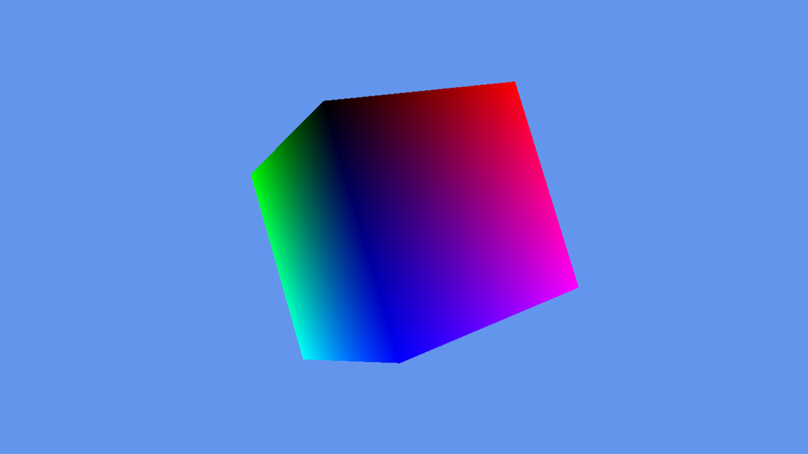

# D3D12-AliceTutorial

이 저장소는 [D3D11-AliceTutorial](https://github.com/Chang-Jin-Lee/D3D11-AliceTutorial)에 이어,
Direct3D 12 그래픽스 파이프라인을 가장 쉬운 단계부터 하나씩 쌓아 올리며 학습하는 튜토리얼 프로젝트입니다.

- 환경: Windows 11, Visual Studio 2022
- 플랫폼: x64 Desktop (Direct3D 12.0)
- 목적: D3D12의 저수준 파이프라인(디바이스, 커맨드 큐/리스트, 디스크립터 힙, 펜스 동기화)을 기초부터 차근차근 학습

### 프로젝트 바로가기

- 이미지를 클릭하거나, 아래 각 번호/이름을 클릭해도 해당 디렉토리로 이동합니다

| [1. ClearScreen](https://github.com/Chang-Jin-Lee/D3D12-AliceTutorial/tree/main/Dx12/01_ClearScreen) | [2. RenderingTriangle](https://github.com/Chang-Jin-Lee/D3D12-AliceTutorial/tree/main/Dx12/02_RenderingTriangle) | [3. RenderingCube](https://github.com/Chang-Jin-Lee/D3D12-AliceTutorial/tree/main/Dx12/03_RenderingCube) | [4. TextureMapping](https://github.com/Chang-Jin-Lee/D3D12-AliceTutorial/tree/main/Dx12/04_TextureMapping) |
|---|---|---|---|
| 

 | 

 | 

 | 

 |

| [5. Lighting](https://github.com/Chang-Jin-Lee/D3D12-AliceTutorial/tree/main/Dx12/05_Lighting) | [6. Lighting_BlinnPhong](https://github.com/Chang-Jin-Lee/D3D12-AliceTutorial/tree/main/Dx12/06_Lighting_BlinnPhong) | [7. NormalMapping](https://github.com/Chang-Jin-Lee/D3D12-AliceTutorial/tree/main/Dx12/07_NormalMapping) |
|---|---|---|
| 

 | 

 | 

 |

---

## 빌드 방식

- 권장 환경: Windows 11, Visual Studio 2022 이상, Windows SDK, MSVC C++ workload
- 솔루션: `Dx12/Dx12Tutorial.sln`
- 플랫폼: `x64` 전용 (D3D12는 실무에서도 거의 항상 x64만 지원하므로 Win32는 제공하지 않습니다)
- 외부 의존성 없음 — Windows SDK(`d3d12.h`, `dxgi1_6.h`)만 사용합니다. vcpkg/서드파티 라이브러리는 필요해지는 단계에서 그때 도입합니다.

## 주의사항
- 수학 라이브러리인 DirectXMath 사용
- 셰이더 컴파일을 위해 `D3DCompileFromFile` 런타임 컴파일 사용
- Debug 빌드에서는 D3D12 디버그 레이어(`ID3D12Debug`)를 활성화합니다

## 참고 자료
- [DirectX-Graphics-Samples (GitHub)](https://github.com/microsoft/DirectX-Graphics-Samples)
- [Direct3D 12 Programming Guide (MSDN)](https://learn.microsoft.com/en-us/windows/win32/direct3d12/directx-12-programming-guide)
- [DirectXMath](https://learn.microsoft.com/en-us/windows/win32/dxmath/pg-xnamath-intro)

---

## 라이선스
본 튜토리얼 프로젝트는 학습 목적이며, [MIT License](LICENSE)에 따라 사용됩니다.
